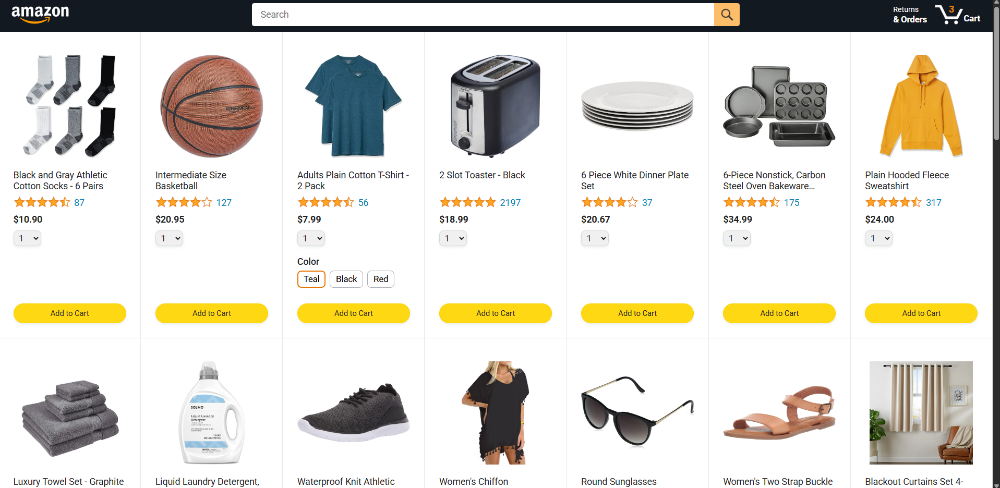
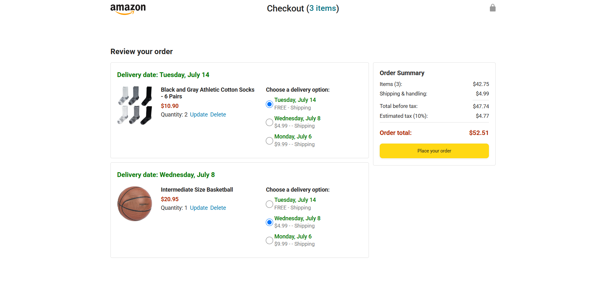
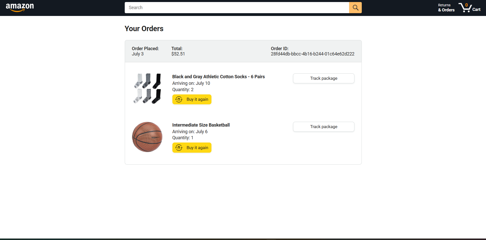
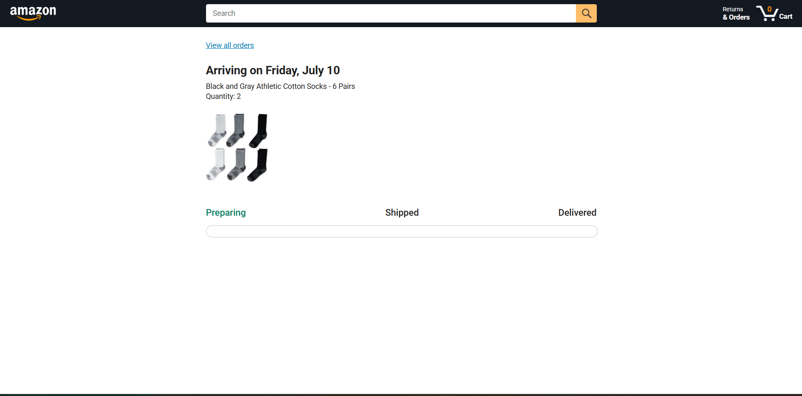

# 🛒 Amazon E-Commerce Web Application

A responsive Amazon-inspired E-Commerce Web Application built using **HTML5, CSS3, and JavaScript (ES6 Modules)**. The project simulates a real-world online shopping experience with product browsing, shopping cart management, checkout, order history, and package tracking while integrating REST APIs and modern JavaScript concepts.

## 🌐 Live Demo

🚀 **Live Application:**  
https://varunnachimuthu-s.github.io/amazon-ecommerce-web-app/

---

## 📸 Project Preview



---

## 🚀 Features

- 🛍️ Browse products dynamically
- 🔍 Search products
- 🛒 Add and remove items from cart
- 💳 Interactive checkout process
- 🚚 Delivery option selection
- 📦 Order history management
- 📍 Package tracking
- 💾 Persistent shopping cart using Local Storage
- 📱 Fully responsive design
- 🧪 Automated testing using Jasmine

---

## 🛠️ Technologies Used

- HTML5
- CSS3
- JavaScript (ES6 Modules)
- Fetch API
- REST APIs
- Async/Await
- Promises
- Local Storage
- Object-Oriented Programming (OOP)
- Jasmine Testing Framework
- Git
- GitHub

---

## 📂 Project Structure

```text
amazon-ecommerce-web-app
│
├── backend/
├── data/
├── images/
├── scripts/
├── styles/
├── tests/
├── index.html
├── checkout.html
├── orders.html
├── tracking.html
└── README.md
```

---

## 📸 Application Screenshots

### 🏠 Home Page


---

### 🛒 Checkout Page



---

### 📦 Orders Page



---

### 🚚 Package Tracking



---

## 💡 JavaScript Concepts Demonstrated

- ES6 Modules
- Object-Oriented Programming
- Classes & Objects
- Async/Await
- Promises
- Fetch API
- DOM Manipulation
- Event Handling
- Local Storage
- Modular Code Organization

---

## 🧪 Testing

The application includes automated testing using the **Jasmine Testing Framework**.

Implemented tests include:

- Unit Testing
- Integration Testing
- Shopping Cart Functionality
- Order Summary Logic
- Utility Functions

---

## ⚙️ Installation

Clone the repository

```bash
git clone https://github.com/Varunnachimuthu-S/amazon-ecommerce-web-app.git
```

Navigate into the project folder

```bash
cd amazon-ecommerce-web-app
```

Run the project by opening

```text
index.html
```

in your preferred web browser.

---

## 📚 Skills Demonstrated

- Frontend Web Development
- Responsive Web Design
- REST API Integration
- JavaScript ES6+
- Object-Oriented Programming
- State Management
- Browser Storage
- Testing & Debugging
- Version Control using Git & GitHub

---

## 👨‍💻 Author

**Varunnachimuthu**

- GitHub: https://github.com/Varunnachimuthu-S

---

⭐ If you found this project helpful, consider giving it a star!
